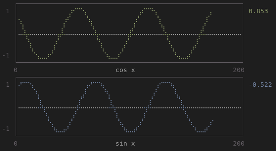

# DataWatcher

Built using [UnicodePlots.jl](https://github.com/Evizero/UnicodePlots.jl), DataWatcher lets you plot and track scalars over time in Julia's REPL. 

---

The original use case for DataWatcher was as a simple, terminal based Tensorboard replacement for tracking scalars like loss and accuracy over epochs when training Flux models. However, it is suitable for any situation in which you might want to continuously monitor scalars over time. 

## Installation

DataWatcher is not yet on the Julia package manager, so download this repo and run

```julia
] dev DataWatcher
```


## Usage

In your program, create a `DataWriter` and call it to add a scalar to track.
For example, the following code continuously computes `sin x` and `cos x` for `[x, x+0.1, ...]` and tracks their values in `sin_cos.jld2`. You can also find this code in `generate_sin_cos.jl`.

```julia
using DataWatcher: DataWriter

function generate_sin_cos()
    writer = DataWriter("sin_cos.jld2")
    local x = 1.0
    while true
        # Calling writer appends the value to a vector
        # in a `Dict` keyed by the provided string, which is then
        # written to "sin_cos.jld2".
        writer(sin(x), "sin x")
        writer(cos(x), "cos x")
        x += 0.1
        sleep(0.1)
    end
end
```

To monitor these values, we fire up the REPL and simply

```julia
using DataWatcher: data_watch

# Plot the values in "sin_cos.jld2" and update every 2 seconds.
data_watch("sin_cos.jld2", inverval=2)
```

This will produce a plot like the following. `Ctrl-C` will stop watching.




## License

This code is free to use under the terms of the MIT license.
